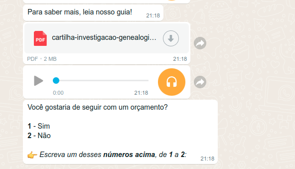
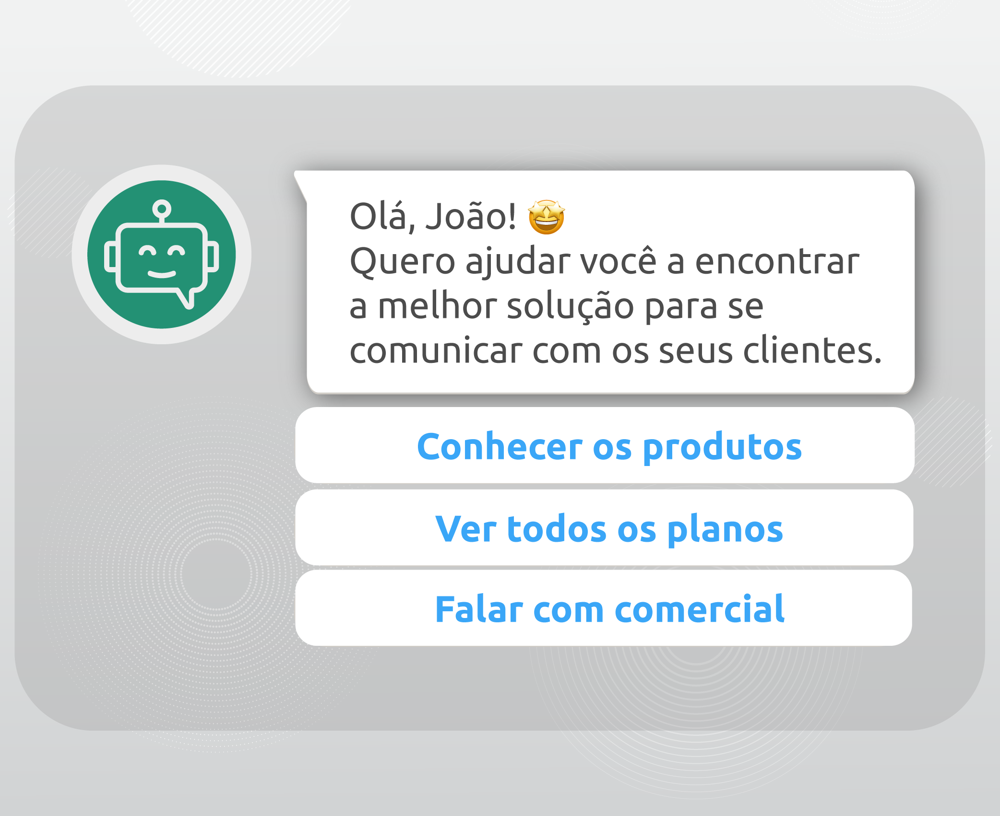

## Chatbot Whatsapp


## Primeiros Passos
__Você usa Ubuntu/Linux?__
Certifique-se de instalar os seguintes pacotes
```
sudo apt-get install -y libgbm-dev
sudo apt install -y gconf-service libasound2 libatk1.0-0 libc6 libcairo2 libcups2 libdbus-1-3 libexpat1 libfontconfig1 libgcc1 libgconf-2-4 libgdk-pixbuf2.0-0 libglib2.0-0 libgtk-3-0 libnspr4 libpango- 1.0-0 libpangocairo-1.0-0 libstdc++6 libx11-6 libx11-xcb1 libxcb1 libxcomposite1 libxcursor1 libxdamage1 libxext6 libxfixes3 libxi6 libxrandr2 libxrender1 libxss1 libxtst6 ca-certificates-fontes xliberation libappgetindicator1 libnssg-liberações-utilize w
```
__Instalar dependências (instalar npm)__
Localize no diretório que você baixou e via console ou terminal execute o seguinte comando (--force ou --legacy--peer-deps)
`npm install`

__Configurar .env__
Com o editor de texto crie um arquivo `.env` que você deve seguir do arquivo `.env.example`
```
######DATABASE: nenhum, mysql, dialogflow
DEFAULT_MESSAGE=true
SAVE_MEDIA=true
PORTA=3000
DATABASE=none
IDIOMA=pt
SQL_HOST=
SQL_USER=
SQL_PASS=
SQL_DATABASE=
#KEEP_DIALOG_FLOW=false
#MULTI_DEVICE=true
```
##### Execute 
Localize no diretório que você baixou e via console ou terminal execute o seguinte comando
`npm run start`

##### Escaneie o código do console
Agora abra o aplicativo Whatsapp no ​​seu dispositivo e escaneie o código.


### Observação
Caso apareça o erro Multi-device, é porque você tem uma conta do WhatsApp afiliada ao modo "Multi-device BETA". No momento, não há suporte para essas pessoas. Se você quiser usar este BOT, você deve sair do modo BETA e experimentá-lo da maneira tradicional. O núcleo do whatsapp é atualizado constantemente, portanto, verifique sempre a data mais recente da atualização

#### Deploy 
 
Deploy não foi feito! Mas pode utilizar o Heroku para QRCode

#### DialogFlow
Siga os passos do link abaixo para criar um agente
https://cloud.google.com/dialogflow/cx/docs/concept/agent?hl=pt-br

#### Funcionamento da estrutura de pastas

| Pasta | Função | 
| ------------- | ------------- |
| .wwebjs_auth | Autenticação quando sobe o primeiro servidor |
| Adapter | lógica dos três possíveis usos 'None, MySQL e DialogFlow' |
| Chats | Salva número e conversa utilizando 'None' |
| Config | Config da Connection SQL |
| Controllers | Funções de Connection, Flows, Handle, Save, Send, Socket e Web |
| Flow | JSONs das mensagens e respostas automáticas |
| Media | Arquivos recebidos: Audios, Imagens e Videos ℹ️ (Não funciona em alguns dispositivos))|
| MediaSend | Arquivos enviados: Audios, Imagens e Videos |
| Middleware | ✅ |
| Routes | QRCode e API Express |
| .env.example | Modelo para utilização usos 'None, MySQL e DialogFlow'|
| .gitignore | ✅ |
| app.js | Importações e Declaração de Porta |
| app.json | ✅ |
| chatbot-account.json | Esquema da chave privada gerada pelo Google Cloud Platform (DialogFlow) ℹ️ (Não funciona em alguns dispositivos)|
| packages/package-lock.json | ✅ |

## Requisitos
- Node v14 ou superior
- VSCode (Editor de código)
- MySql (opcional) só se aplica se você for usar o modo 'mysql' [migração sql-bot.sql](https://github.com/leifermendez/bot-whatsapp/blob/main/sql-bot.sql )
- Dialogflow (opcional) só se aplica se você for usar o modo 'dialogflow'

### Botões


Para implementar os botões você só precisa usar o método __sendMessageButton__ encontrado dentro de `./controllers/send` Deixo um exemplo de como usá-lo.

```javascript
const { sendMessageButton } = require('./controllers/send')
aguarde sendMessageButton(
    {
        "title":"O que você está interessado em assistir?",
        "message":"Lembre-se de que todo este conteúdo é gratuito e seria ótimo se você me seguisse!",
        "rodapé":"Obrigado",
        "botões":[
            {"body":"😎 Cursos"},
            {"body":"👉YouTube"},
            {"body":"😁 Telegrama"}
        ]
    }
)
```

## Áudios
<p style="text-align: center">
    
</p>

Audios formatados nativamente podem ser enviados para que não pareçam encaminhados. Neste exemplo vou enviar o arquivo __PTT-20220223-WA0000.opus__ que está dentro da pasta __/mediaSend__

```javascript
const { sendMediaVoiceNote } = require('./controllers/send')
aguarde sendMediaVoiceNote (cliente, de, 'PTT-20220223-WA0000.opus')
```

